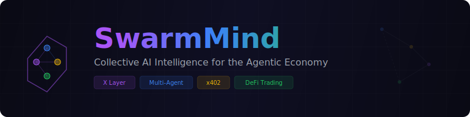
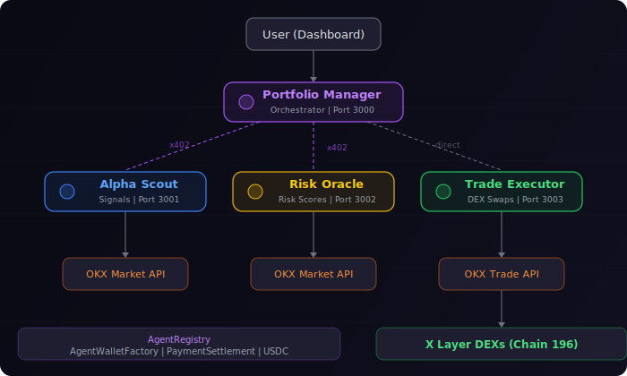

<p align="center">
  
</p>

<p align="center">
  <a href="./README.md">English</a> | 中文
</p>

<p align="center">
  
  
  
  
  
</p>

SwarmMind 是一个自主运行的多 AI Agent DeFi 情报网络。4 个专业化 AI Agent 在 X Layer 上发现、评估和执行交易机会，并通过 x402 微支付协议互相付费。

为 [X Layer AI Hackathon](https://x.com/XLayerOfficial) (Phase 1: 2026年3月12-26日) 构建。

## 为什么 SwarmMind 能赢

| 评审标准 | SwarmMind 的表现 |
|---|---|
| **深度 AI-Agent 链上集成** | 4 个 AI Agent，各有独立钱包，链上注册，自主决策 |
| **自主支付流程** | Agent 间 x402 HTTP 微支付，USDC 在 X Layer 上结算 |
| **多 Agent 协作架构** | 经济激励：Scout 卖信号赚钱，Oracle 卖风险评估赚钱 |
| **生态影响力** | 可复用基础设施：AgentRegistry、WalletFactory、PaymentSettlement |
| **OKX OnchainOS** | 使用 Market API 获取数据，Trade API 执行 DEX 交易 |

## 架构

<p align="center">
  
</p>

### Agent 角色

| Agent | 角色 | 端口 | 付费模式 |
|-------|------|------|----------|
| **Portfolio Manager** | 总指挥 - 解析用户策略，协调其他 Agent | 3000 | 通过 x402 付费给其他 Agent |
| **Alpha Scout** | 市场情报 - 用 AI 分析市场数据生成交易信号 | 3001 | 出售信号 ($0.001-$0.005 USDC/次) |
| **Risk Oracle** | 风险评估 - 用 AI 评估交易提案的风险 | 3002 | 出售评估 ($0.001-$0.002 USDC/次) |
| **Trade Executor** | DEX 执行 - 在 X Layer 上执行代币交换 | 3003 | 内部调用 (API Key 保护) |

### 支付流程 (x402 协议)

```
Portfolio Manager  ──GET /signals/latest──>  Alpha Scout
                   <──402 Payment Required──
                   ──签名 EIP-712 授权────>
                   <──200 OK + 信号数据────  (USDC 在 X Layer 上结算)
```

## 已部署合约 (X Layer 测试网)

| 合约 | 地址 | 用途 |
|------|------|------|
| AgentRegistry | [`0xf159428B...`](https://www.oklink.com/xlayer-test/address/0xf159428B2909159e2dd14aF0EFF37fe8fEb4C46f) | 链上 Agent 目录与信誉追踪 |
| AgentWalletFactory | [`0xE1c33aaC...`](https://www.oklink.com/xlayer-test/address/0xE1c33aaC0fFe7DF85dD37a00f537e3f210348546) | CREATE2 确定性钱包工厂 |
| PaymentSettlement | [`0xEF334ADc...`](https://www.oklink.com/xlayer-test/address/0xEF334ADc78f78650C869baCdc88D1BA0D87B9aE8) | USDC 支付审计链 |

### 链上交易证明

**Agent 注册交易：**
- Alpha Scout: [`0x86195729...`](https://www.oklink.com/xlayer-test/tx/0x86195729a9de9f82dcec78f8e304f20a9454ba87bb7b0f86848c30954d657d4e)
- Risk Oracle: [`0x53bb8f78...`](https://www.oklink.com/xlayer-test/tx/0x53bb8f785ea176fe3d2632481f45d00cbfd820a316de7d58d6f9f979c1b66094)
- Trade Executor: [`0x0ecfed4f...`](https://www.oklink.com/xlayer-test/tx/0x0ecfed4f1d294b69fdf299a76b7ea00030e5684db74b9271e67ef619f65cdc38)
- Portfolio Manager: [`0xcc8fb97b...`](https://www.oklink.com/xlayer-test/tx/0xcc8fb97be359039e68a93038744ce4553aad785ffba6a369404910cfe08480b1)

**Agent 间支付交易 (x402 模拟)：**
- PM -> Alpha Scout: [`0xaa788ab3...`](https://www.oklink.com/xlayer-test/tx/0xaa788ab38f912e03b1d37c380668f99260d5348a27c9d21fc4da919a50815576)
- PM -> Risk Oracle: [`0x3f941778...`](https://www.oklink.com/xlayer-test/tx/0x3f941778de0dcb0197e62d8c5a671e99c83325f5627bf0194e4df7a094c0d035)

## 技术栈

| 层 | 技术 |
|----|------|
| 智能合约 | Solidity 0.8.24 + Hardhat + OpenZeppelin |
| Agent 后端 | TypeScript + Node.js + Express |
| AI 推理 | 多模型支持 (Claude, GPT, DeepSeek, OpenRouter) |
| DEX 交易 | OKX OnchainOS Trade API |
| 市场数据 | OKX OnchainOS Market API |
| 支付 | x402 HTTP 协议 + USDC 直接结算 |
| 前端 | Next.js + TailwindCSS + Recharts |
| 区块链 | ethers.js v6, X Layer (Chain ID 196) |
| 项目管理 | Turborepo + npm workspaces |
| 测试 | Vitest (Agent) + Hardhat/Chai (合约) |

## 快速开始

### 前置要求

- Node.js 20+
- npm 10+
- X Layer 上的 OKB 作为 gas (~$0.001/笔)
- 一个 AI API Key (Anthropic、OpenAI、DeepSeek 或 OpenRouter)

### 安装

```bash
git clone https://github.com/KuaaMU/swarmmind.git
cd swarmmind
npm install

# 配置环境变量
cp .env.example .env
# 编辑 .env，填入你的 API Key 和钱包私钥

# 构建所有包
npm run build
```

### 运行测试

```bash
# 所有测试 (148 个全部通过)
npm test

# 或单独运行:
# 智能合约测试 (29 个)
cd packages/contracts && npx hardhat test

# Agent 单元测试 (119 个)
# shared: 47 | alpha-scout: 8 | risk-oracle: 21 | portfolio-manager: 18 | trade-executor: 25
npx vitest run
```

### 部署合约

```bash
cd packages/contracts

# 测试网
npx hardhat run scripts/deploy.ts --network xlayerTestnet

# 注册 Agent 到链上
npx hardhat run scripts/register-agents.ts --network xlayerTestnet

# 主网
npx hardhat run scripts/deploy.ts --network xlayer
```

### 运行 E2E 演示

```bash
# 完整演示: Agent 验证 -> 信号生成 -> 风险评估 -> 链上支付
npx tsx scripts/demo-e2e.ts
```

### 启动 Agent

```bash
# 开发模式 (通过 Turborepo 启动所有 Agent)
npm run dev

# 或单独启动
cd packages/agents/alpha-scout && npm run dev
cd packages/agents/risk-oracle && npm run dev
cd packages/agents/trade-executor && npm run dev
cd packages/agents/portfolio-manager && npm run dev
```

## 智能合约

### AgentRegistry.sol (~130 行)
链上 Agent 服务目录。存储钱包地址、名称、角色 (SCOUT/ORACLE/EXECUTOR/MANAGER)、服务端点、定价、收入/支出计数器。

### AgentWalletFactory.sol (~80 行)
通过 OpenZeppelin Clones (最小代理模式) 实现 CREATE2 确定性钱包创建。每个钱包约 $0.001 部署成本。

### PaymentSettlement.sol (~120 行)
记录 Agent 间 USDC 转账，提供链上审计追踪。支持单笔和批量结算。

## 项目结构

```
swarmmind/
├── packages/
│   ├── contracts/                  # Solidity 智能合约
│   │   ├── contracts/              # 3 个核心合约
│   │   ├── scripts/                # 部署和注册脚本
│   │   └── test/                   # 29 个 Hardhat 测试
│   ├── agents/
│   │   ├── shared/                 # 公共基础设施
│   │   │   └── src/
│   │   │       ├── ai/            # 多模型 AI 客户端
│   │   │       ├── okx/           # OnchainOS Market + Trade API
│   │   │       ├── payments/      # x402 客户端/服务端 + 直接支付
│   │   │       ├── wallet/        # Agent 钱包 (ethers.js)
│   │   │       └── config/        # X Layer 配置 + 环境变量
│   │   ├── alpha-scout/           # 市场信号 Agent (端口 3001)
│   │   ├── risk-oracle/           # 风险评估 Agent (端口 3002)
│   │   ├── trade-executor/        # DEX 交易 Agent (端口 3003)
│   │   └── portfolio-manager/     # 总指挥 Agent (端口 3000)
│   └── dashboard/                 # Next.js 前端
├── scripts/                       # E2E 演示和 AI 测试脚本
├── docker-compose.yml
└── turbo.json
```

## X Layer 集成

| | 主网 | 测试网 |
|---|---|---|
| Chain ID | 196 | 1952 |
| RPC | `https://rpc.xlayer.tech` | `https://testrpc.xlayer.tech` |
| 浏览器 | [oklink.com/xlayer](https://www.oklink.com/xlayer) | [oklink.com/xlayer-test](https://www.oklink.com/xlayer-test) |
| Gas | OKB (~$0.0001/笔) | OKB ([水龙头](https://www.okx.com/xlayer/faucet)) |
| USDC | `0x74b7F16337b8972027F6196A17a631aC6dE26d22` | - |

## AI 模型配置

SwarmMind 支持多种 AI 模型。在 `.env` 中配置：

```bash
# 选择: anthropic | openai | deepseek | openrouter
AI_PROVIDER=anthropic
ANTHROPIC_API_KEY=your_key

# 可选: 指定模型
AI_MODEL=claude-haiku-4-5-20251001

# 可选: 中转站/代理端点
AI_BASE_URL=https://your-relay.com
```

支持的默认模型: Claude Haiku 4.5 (anthropic), GPT-4o-mini (openai), DeepSeek Chat (deepseek)。

## 许可证

MIT
